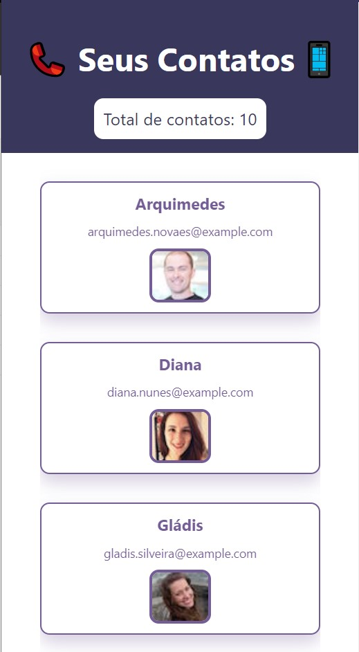

<!-- Logo -->
<div align="center">
  <h1>Contact List</h1>
  <p>A simple and elegant way to see yours contacts</p>
</div>

<div align="center">
  
</div>

## 🧪 Technologies

This project has made with the following technologies:
- [React-Native](https://reactnative.dev/)
- [Expo](https://expo.dev/)

## 🚀 Installing

For download the _Contact List_, follow this steps:

Windows, Linux e MacOs
```
git clone https://github.com/Igorcbraz/Contact-list.git
```

## ☕ Opeing the app in your phone 

For use the _Contact List_, follow this steps:

Join in the folder of the project, and run :
```
npm install
npm install --global expo-cli
```
Run the project
```
expo start
```

> 👨‍👩‍👧‍👧You can open the project on multiple devices simultaneously. Go ahead and try it on an iPhone and Android phone at the same time if you have both handy.

🍎 On your iPhone or iPad, open the default Apple "Camera" app and scan the QR code you see in the terminal or in Expo Dev Tools.

🤖 On your Android device, press "Scan QR Code" on the "Projects" tab of the Expo Go app and scan the QR code you see in the terminal or in Expo Dev Tools.

Now, you can see this awesome application :)

